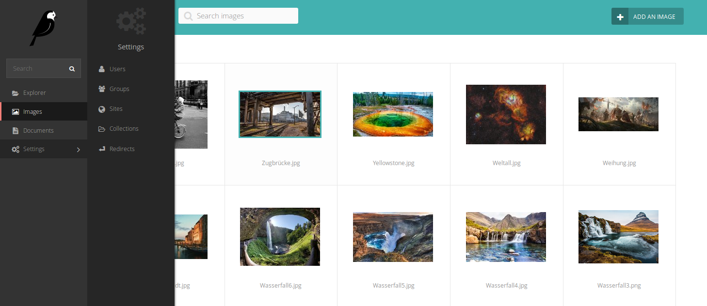
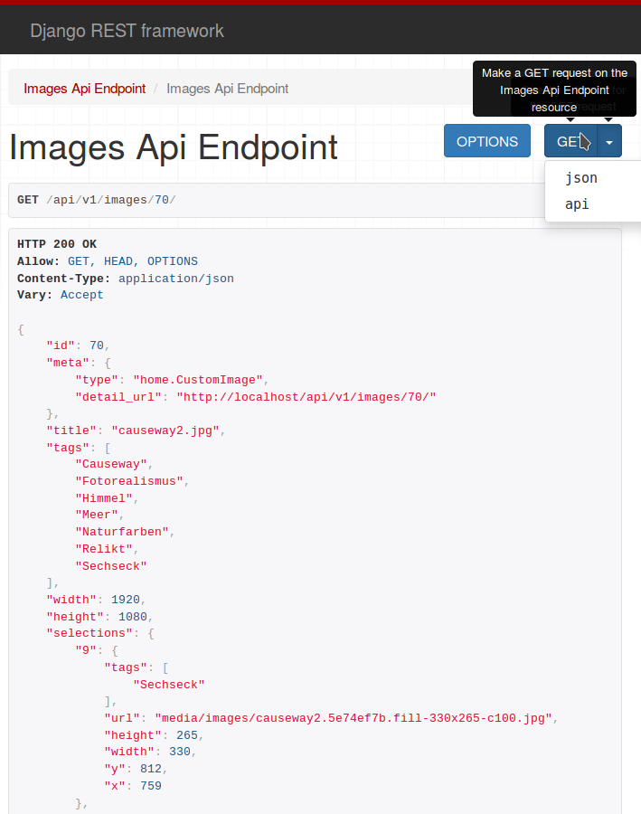

.. _wagtail:

=======
Wagtail
=======

`Wagtail <https://wagtail.io/>`_ ist ein Opensource CMS für `Django <https://www.djangoproject.com/>`_ von Torchbox. Es bietet eine übersichtliche Multidevice-Oberfläche um Inhalte in die eigenen Wagtailfelder wie das Streamfield einzupflegen, als auch eine intuitive Bilderveraltung mit einer automatischen Fokuserkennung und Zentrierung. Die Bildverwaltung ist der Ausgangspunkt für eigene Erweiterungen.

REST
====

Das `Django Rest Framework <https://www.django-rest-framework.org/>`_ bietet ein mächtiges Werkzeug um eigene Web APIs zu erstellen. In Wagtail gibt es für die Bilder, Dokumente und den eigenen Seitenbaum vordefinierte Restendpunkte. Für wagtailtagging werden diese Endpunkte mit einer möglichen Filterung bereitgestellt. Neuere Features wie die Schemagenerierung wurden nicht ausgetestet.

