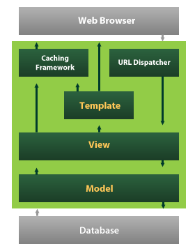

.. _Softwarearchitektur:

===================
Softwarearchitektur
===================

Dieses Kapital gibt einen Überblick, wie die Architektur der selber geschriebenen Software und die der darunter liegenden Frameworks aussieht.

Django-Architektur
==================

Django scheint auf den ersten Blick ein MVC-Framework zu sein, hat dieses Pattern allerdings dem Web angepasst und zu einem MTV-Architektur (Modell-View-Template) umgebaut. Verwirrenderweise wurde der Controller in View umbenannt und die View hat sich zu einer Template-Engine gemausert. Die View regelt nun welche Daten und Templates über bestimmte url-patterns zurückgegeben werden. In den Templates wird geregelt wie die Daten dargestellt werden.

Die Modells in Django bestehen hauptsächlich aus ORM-Beschreibungen. Dadurch wird die Persistenz der Daten sehr gut von der Bearbeitung getrennt. In diesem Projekt wurde die Posgtres-Datenbank benutzt, da die neusten Features meistens direkt in Django integriert werden (wie z.B. das JSONField). Es sind aber auch andere Datenbanken wie MySql, Neo4j oder Redis nutzbar. Änderungen der Datenbankstruktur können sehr einfach in Migration-Files gespeichert werden.

Wagtail-Architektur
===================

Wagtail bietet eine einfach anzupassende modulare Struktur, deren Basis die Djangoarchitektur ist. Um das CMS anzupassen kann man sich selber in der Opensource-Entwicklung einbringen, über eigene Forks die Core-Komponenten überschreiben oder eigene `Wagtailapps <https://www.django-rest-framework.org>`_ erstellen. Aus Zeitgründen wurde keine eigene App erstellt, sondern Hooks benutzt und Komponenten überschrieben.

Die 'Page' stellt die Grundeinheit für den Inhalt bereit, die über eigene Django-Modells definiert werden. Zu den selbst definierten Felder stellt Wagtail standardmäßig weitere Felder zur Verfügung.  Die einzelnen Seiten werden wiederum in Bäumen gehalten, der normalerweise über Knoten und Blätter verfügt. Im Falle von wagtailtagging ist dies eine flache Blattstruktur. Der Inhalt der Seiten wird über das normale Django-Template-System bereitgestellt.

Zusammen mit der AbstractRendition ist das AbstractImage eine simple Möglichkeit das Standardbildmodell anzupassen. Dafür werden im abgeleiteten Imageobjekt neue Felder hinzugefügt oder überschrieben und das neue Image in der abgeleiteten Rendition verlinkt.

Wagtailtagging-Architektur
==========================

Im folgenden wird die Software in die zwei Komponenten 'Öffentliche Ansicht' und 'Erweiterungen im CMS-Bereich' aufgeteilt. In der öffentlichen Ansicht werden ausschließlich die erstellten Daten dargestellt. Natürlich greift diese Komponente auf die abgeänderten Bildmodelle zu und benutzt hierfür die Standardvorgehensweise von Django. Ansonsten werden keine Architektureingriffe vorgenommen.

Die Erweiterungen im CMS-Bereich beruhen auf den erwähnten Änderungen im Bildmodell, überschriebenen Formularen und überschriebene Templates der Bilddetailansicht. Die standardmäßige Detailansicht mit der Möglichkeit das Bild mit Tags zu versehen und einen Ausschnitt als 'Focal-Point' auszuwählen,  wurde durch eine Mehrfachauswahl von Bildausschnitten erweitert. Zudem wurde eine Ansicht zum Bilderfreistellen implementiert, die vom Aufbau und der Kommunikation mit dem Server auf Django beruht. Erst beim Speichervorgang wird wieder in die Wagtail-Architektur eingegriffen.
